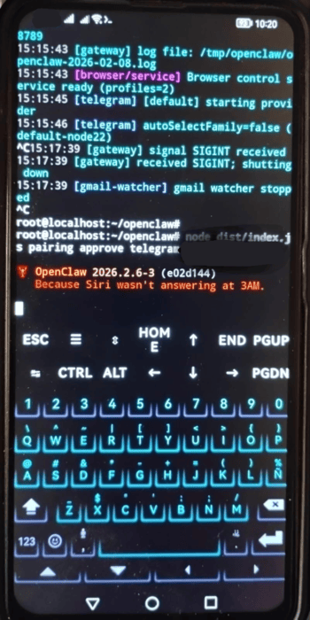
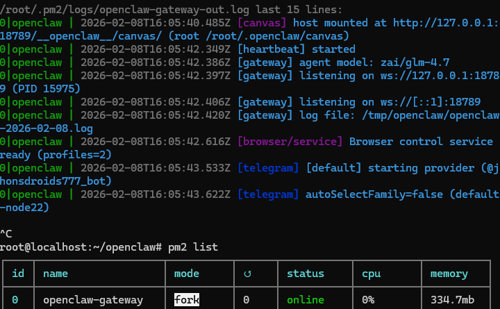
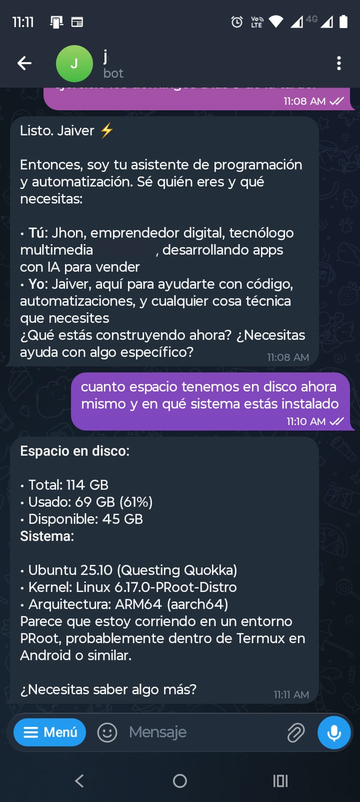

# OpenClaw Installation Guide for Android (Termux + aarch64)

This guide provides a step-by-step walkthrough for compiling and running **OpenClaw** on Android devices with **aarch64** architecture. To ensure maximum compatibility with native Node.js modules, we use a controlled environment via `proot-distro`.

---

## 🔗 Official Project
This is a deployment guide for: [**OpenClaw/OpenClaw**](https://github.com/openclaw/openclaw)

---

## 1. Essential Requirement: Termux (F-Droid)

**IMPORTANT:** Do NOT use the Google Play Store version, as it is outdated and will cause repository errors.

* **Download:** [Termux on F-Droid](https://f-droid.org/es/packages/com.termux/)
* **Note:** After installation, grant storage permissions by running: `termux-setup-storage`.

## 2. Termux Preparation

Install the base tools required to manage Linux distributions.

```bash
pkg update && pkg upgrade -y
pkg install proot-distro -y
proot-distro install ubuntu
```

## 3. Linux Environment Setup (Ubuntu)

Enter the distribution
```bash
proot-distro login ubuntu
```

Update and install system dependencies
```bash
apt update && apt upgrade -y
apt install git curl build-essential python3 pip cmake libvips-dev openssh-server -y
```
## 4. Install Node.js v22 & PNPM

Install Node.js
```bash
curl -fsSL https://deb.nodesource.com/setup_22.x | bash -
apt install -y nodejs
```

Install pnpm globally
```bash
npm install -g pnpm@10.23.0
```
## 5. Clone and Compile OpenClaw
```bash
git clone https://github.com/openclaw/openclaw.git
cd openclaw
```
Install dependencies and build
```bash
pnpm install
pnpm build
```
## 6. Initial Configuration & Pairing (Onboard & Pairing)

Run Onboarding: Follow the on-screen instructions to configure your AI models and providers.
```bash
node dist/index.js onboard
```
Account Pairing: Use the code provided by your Telegram bot or the system:

    
```bash
node dist/index.js gateway
```
write message bot telegram and request code pairing

    # Replace ABC123 with your actual code

```bash
node dist/index.js pairing approve telegram ABC123
```

```bash
node dist/index.js gateway
```

## 7. Start OpenClaw in Background (PM2) optional

Install PM2 (Process Manager):
```bash
npm install -g pm2
```
Once configured, launch the Gateway to keep it running 24/7.
```bash
pm2 start dist/index.js --name "gateway" -- gateway start
```
Management Commands:

View logs: 
```bash
pm2 logs gateway
```
Process status: 
```bash
pm2 list
```
Restart: 
```bash
pm2 restart gateway
```
## 📱 About the Author & Social Media
Feel free to connect with me for more AI and Tech content:

- 💼 [LinkedIn](https://www.linkedin.com/in/jhonsupelano/)
- 🐦 [X](https://x.com/JHONSU777)
- ▶️ [YouTube](https://www.youtube.com/@JhonSupelanoRojas)

## Screenshots





## 📄 License
This project is licensed under the MIT License.

## 🛠️ Troubleshooting

Wakelock: Ensure you enable "Acquire wakelock" in the Termux notification drawer to prevent Android from suspending the CPU.

Systemd Error: You can safely ignore systemctl unavailable errors. PM2 handles process management correctly.

Note: ⚠️Some Android models block the network and this may not work; it works on older Android models.

Remote Access: If you cannot access the Dashboard from your PC, edit ~/.openclaw/config.toml and set host = "0.0.0.0".
