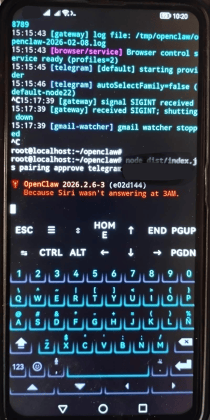
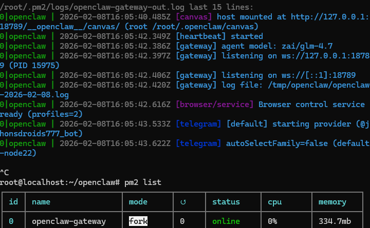
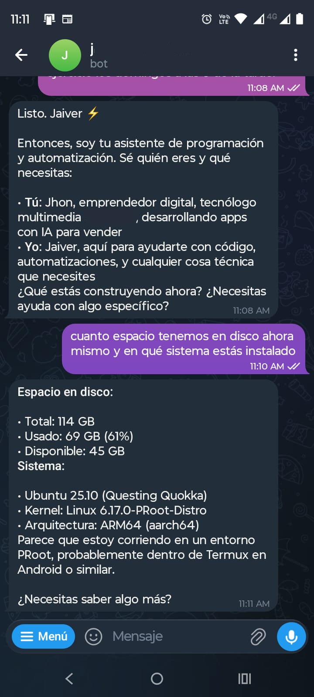

[](https://deepwiki.com/jhonsu01/openclaw-for-android-termux-aarch64)
# OpenClaw Installation Guide for Android (Termux + aarch64)

This guide provides a step-by-step walkthrough for compiling and running **OpenClaw** on Android devices with **aarch64** architecture. To ensure maximum compatibility with native Node.js modules, we use a controlled environment via `proot-distro`.

---

## 🔗 Official Project
This is a deployment guide for: [**OpenClaw/OpenClaw**](https://github.com/openclaw/openclaw)

---

## 1. Essential Requirement: Termux (F-Droid)

**IMPORTANT:** Do NOT use the Google Play Store version, as it is outdated and will cause repository errors.

* **Download:** [Termux on F-Droid](https://f-droid.org/es/packages/com.termux/)
* **Note:** After installation, grant storage permissions by running:
```bash  
termux-setup-storage
```
```bash  
termux-wake-lock
```
## 2. Termux Preparation

Install the base tools required to manage Linux distributions.

```bash
pkg update && pkg upgrade -y
pkg install proot-distro -y
proot-distro install ubuntu
```

## 3. Linux Environment Setup (Ubuntu)

Enter the distribution
```bash
proot-distro login ubuntu
```

Update and install system dependencies
```bash
apt update && apt upgrade -y
apt install git curl build-essential python3 pip cmake libvips-dev openssh-server -y
```
## 4. Install Node.js v22 & PNPM

Install Node.js
```bash
curl -fsSL https://deb.nodesource.com/setup_22.x | bash -
```
```bash
apt install -y nodejs
```

Install pnpm globally
```bash
npm install -g pnpm@10.29.3
```
## 5. Install OpenClaw
```bash
npm install -g openclaw@latest
```

## 6. Fix Android Network Error

Create a hijack script
```bash
cat <<EOF > /root/hijack.js
const os = require('os');
os.networkInterfaces = () => ({});
EOF
```
```bash
echo 'export NODE_OPTIONS="-r /root/hijack.js"' >> ~/.bashrc
source ~/.bashrc
```
## 7. Start OpenClaw 
```bash
openclaw gateway --verbose
```
other console

```bash
openclaw tui
```


## 📱 About the Author & Social Media
Feel free to connect with me for more AI and Tech content:

- 💼 [LinkedIn](https://www.linkedin.com/in/jhonsupelano/)
- 🐦 [X](https://x.com/JHONSU777)
- ▶️ [YouTube](https://www.youtube.com/@JhonSupelanoRojas)

## Screenshots





## 📄 License
This project is licensed under the MIT License.

## 🛠️ Troubleshooting

Wakelock: Ensure you enable "Acquire wakelock" in the Termux notification drawer to prevent Android from suspending the CPU.

Systemd Error: You can safely ignore systemctl unavailable errors. PM2 handles process management correctly.

Note: ⚠️Some Android models block the network and this may not work; it works on older Android models.

Remote Access: If you cannot access the Dashboard from your PC, edit ~/.openclaw/config.toml and set host = "0.0.0.0".
